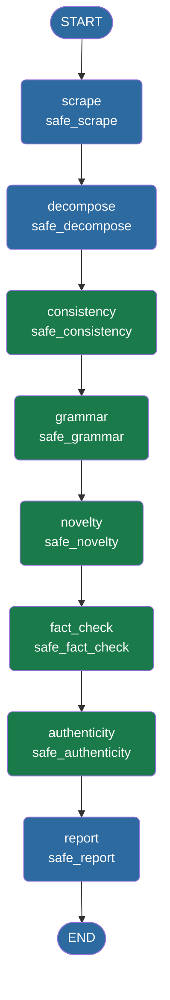

# `src/graph.py` — LangGraph Pipeline

## Purpose

Defines the `ReviewState` TypedDict, all graph node functions, and assembles the LangGraph `StateGraph` that orchestrates the full paper-review pipeline.

## Imports

| Import | Used for |
|--------|----------|
| `from __future__ import annotations` | Postponed evaluation of type hints |
| `time` | Node execution timing |
| `traceback` | Capturing full tracebacks in `_safe_run` |
| `typing` (`Any`, `Dict`, `Optional`, `TypedDict`) | `ReviewState` type definition |
| `langchain_ollama.ChatOllama` | LLM client in `node_decompose` |
| `langgraph.graph` (`END`, `START`, `StateGraph`) | Graph construction |
| Agent imports | `AuthenticityAgent`, `ConsistencyAgent`, `FactCheckAgent`, `GrammarAgent`, `NoveltyAgent` |
| `.decomposer.decompose_paper` | Section decomposition node |
| `.logger.get_logger` | Structured logging |
| `.report_generator.generate_report` | Report generation node |
| `.scraper.scrape_paper` | Paper scraping node |

## `ReviewState` Schema

```python
class ReviewState(TypedDict):
    url: str                          # Input arXiv URL
    model_name: str                   # Ollama model to use
    paper_metadata: Dict[str, Any]    # title, authors, published, etc.
    paper_text: str                   # Full scraped text
    abstract: str                     # Raw abstract from arXiv API
    sections: Dict[str, str]          # Decomposed sections
    consistency_result: Dict[str, Any]
    grammar_result: Dict[str, Any]
    novelty_result: Dict[str, Any]
    fact_check_result: Dict[str, Any]
    authenticity_result: Dict[str, Any]
    final_report: str                 # Markdown report
    current_step: str                 # Progress tracking
    error: Optional[str]              # Captured error if any node fails
```

## Graph Topology



> **Blue nodes** — data pipeline (scrape, decompose, report).  
> **Green nodes** — LLM analysis agents (each calls Ollama once).

```
┌─────────────────────────────────────────────────────────────┐
│                        ReviewState                          │
│  url · model_name · paper_metadata · paper_text · abstract  │
│  sections · consistency_result · grammar_result             │
│  novelty_result · fact_check_result · authenticity_result   │
│  final_report · current_step · error                        │
└─────────────────────────────────────────────────────────────┘
         │
         ▼
   ┌──────────┐     scrape_paper()        arXiv API + HTML
   │  scrape  │ ─────────────────────────────────────────────▶
   └──────────┘
         │
         ▼
   ┌────────────┐   decompose_paper()     regex → LLM fallback
   │  decompose │ ─────────────────────────────────────────────▶
   └────────────┘
         │
         ▼
   ┌─────────────┐  ConsistencyAgent      Ollama (JSON mode)
   │ consistency │ ─────────────────────────────────────────────▶
   └─────────────┘
         │
         ▼
   ┌─────────┐       GrammarAgent         Ollama (JSON mode)
   │ grammar │ ─────────────────────────────────────────────────▶
   └─────────┘
         │
         ▼
   ┌─────────┐       NoveltyAgent         arXiv search + Ollama
   │ novelty │ ─────────────────────────────────────────────────▶
   └─────────┘
         │
         ▼
   ┌────────────┐    FactCheckAgent       Ollama (JSON mode)
   │ fact_check │ ───────────────────────────────────────────────▶
   └────────────┘
         │
         ▼
   ┌──────────────┐  AuthenticityAgent    Ollama (JSON mode)
   │ authenticity │ ───────────────────────────────────────────▶
   └──────────────┘
         │
         ▼
   ┌────────┐        generate_report()    pure Python → Markdown
   │ report │ ─────────────────────────────────────────────────▶
   └────────┘
         │
         ▼
       END
```

All nodes are wrapped with `_safe_run` so a single agent failure captures the error in `state["error"]` instead of crashing the graph.

## Key Functions

### `_safe_run(node_name, fn, state) -> dict`
Wraps any node function. On exception: logs the traceback and returns `{"error": ..., "current_step": node_name}`.

### `create_review_graph()`
Builds and compiles the `StateGraph`. Called once per analysis run.

### `run_review(url, model_name) -> ReviewState`
Convenience function for CLI / scripted use. Runs the full pipeline synchronously and returns the final state.

## Usage

```python
from src.graph import create_review_graph, ReviewState

graph = create_review_graph()
for step_output in graph.stream(initial_state):
    node_name = list(step_output.keys())[0]
    ...
```
